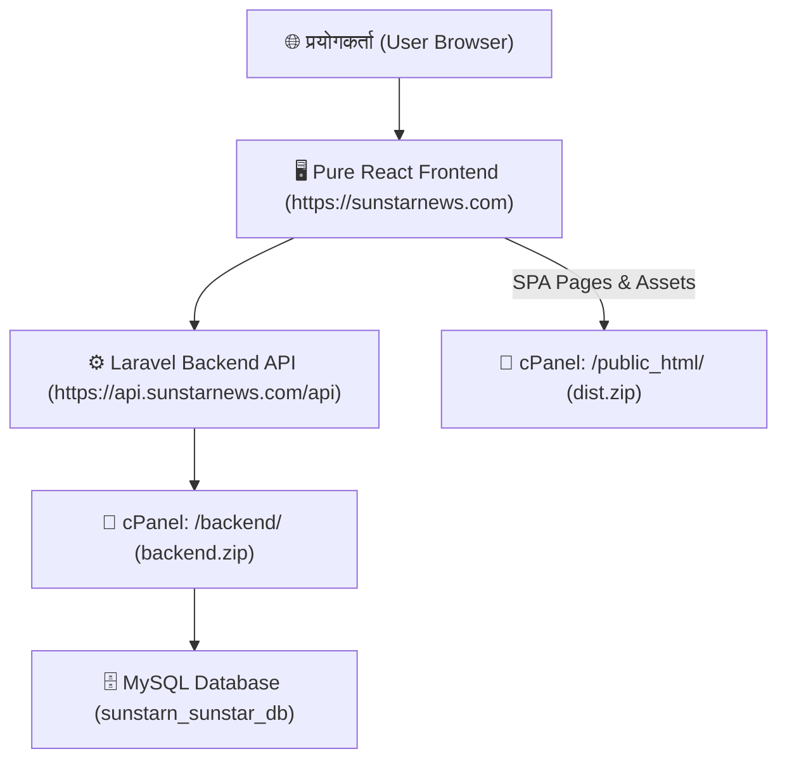

# 🚀 Sunstar News (सनस्टार न्युज) - cPanel Deployment & Upload Documentation
**Pure React.js Frontend + Laravel 11 Backend + cPanel MySQL Database**

यो दस्ताबेजमा सनस्टार न्युजलाई **cPanel** मा सफलतापूर्वक अपलोड र होस्ट गर्दा अपनाइएका सबै चरणहरू, कन्फिगरेसन र भविष्यमा अपडेट गर्ने तरिकाहरू विस्तृत रूपमा लेखिएको छ।

---

## 🏛️ १. प्रणालीको संरचना (System Architecture)



- **Frontend (`https://sunstarnews.com`)**: १००% Pure Static React.js (HTML + CSS + Client JS)। cPanel मा कुनै पनि `Node.js` वा `server.js` आवश्यक पर्दैन।
- **Backend (`https://api.sunstarnews.com`)**: Laravel 11 PHP API। सबै डेटा, समाचार, विज्ञापन र इमेज प्रोसेसिङ यसैले गर्दछ।
- **डेटाबेस**: cPanel MySQL (`sunstarn_sunstar_db`)।

---

## 📦 २. मुख्य फाइल प्याकेजहरू

| फाइल | साइज | गन्तव्य फोल्डर | विवरण |
| :--- | :--- | :--- | :--- |
| **`schema.sql`** | ~१० KB | cPanel phpMyAdmin | सम्पूर्ण डेटाबेस संरचना, तालिकाहरू र एडमिन खाता |
| **`backend.zip`** | ~२४ MB | `/home/username/` (Home Root) | Laravel Backend (PHP + Composer Vendor समावेश) |
| **`dist.zip`** | ~४.६ MB | `/home/username/public_html/` | Pure React Static Frontend (index.html, JS, CSS) |

---

## 📋 ३. चरणबद्ध अपलोड तथा होस्टिङ प्रक्रिया (Step-by-Step)

### चरण १: MySQL Database बनाउने र Import गर्ने
1. cPanel मा **"MySQL® Databases"** मा गइयो:
   - **Database Name**: `sunstarn_sunstar_db` बनाइयो।
   - **Database User**: `sunstarn_sunstarnews` बनाइयो।
2. **"Add User To Database"** मा गएर User र Database छानेर **"Add"** थिचियो र **"ALL PRIVILEGES"** (सबै अधिकार) दिएर **"Make Changes"** गरियो।
3. cPanel **"phpMyAdmin"** खोलियो:
   - बायाँ साइडबारबाट `sunstarn_sunstar_db` मा क्लिक गरियो।
   - माथिको **"Import"** ट्याबमा गएर **`schema.sql`** अपलोड गरियो।
   - *(Users, Articles, Banners, Categories, Sessions, Cache लगायत सबै ३३ टेबलहरू बने)*।

---

### चरण २: Laravel Backend अपलोड र कन्फिगरेसन
1. cPanel **File Manager** को मुख्य Home Directory (`/` वा `/home/username/`) मा गइयो।
2. **`backend.zip`** अपलोड गरेर त्यहीँ **Extract** गरियो (यसले सिधै `/backend/` फोल्डर बनायो)।
3. `backend` भित्र रहेको **`.env`** फाइलमा निम्न विवरण सेट गरियो:
   ```env
   APP_NAME="Sunstar News API"
   APP_ENV=production
   APP_DEBUG=false
   APP_URL=https://api.sunstarnews.com

   DB_CONNECTION=mysql
   DB_HOST=127.0.0.1
   DB_PORT=3306
   DB_DATABASE=sunstarn_sunstar_db
   DB_USERNAME=sunstarn_sunstarnews
   DB_PASSWORD=sunstarnews

   SESSION_DRIVER=database
   CACHE_STORE=database
   FILESYSTEM_DISK=public
   ```
4. cPanel को **"MultiPHP Manager"** मा गएर PHP भर्सनलाई **PHP 8.2** वा **PHP 8.3/8.4** मा सेट गरियो।
5. `backend/vendor/composer/platform_check.php` मा PHP अनुकूलता मिलाइयो।

---

### चरण ३: API Subdomain सिर्जना गर्ने
1. cPanel ड्यासबोर्ड ➔ **"Domains"** ➔ **"Create A New Domain"** मा क्लिक गरियो।
2. **Domain Name**: `api.sunstarnews.com`
3. **Document Root**: **`backend/public`** (वा `/home/username/backend/public`) राखियो।
4. **Submit** गरियो।
   - *जाँच नतिजा:* `https://api.sunstarnews.com/api/banners` र `https://api.sunstarnews.com/api/dashboard` दुवैमा **HTTP 200 OK** सफल भयो।

---

### चरण ४: Pure React Frontend अपलोड गर्ने
1. cPanel File Manager मा गएर **`public_html`** फोल्डर खोलियो।
2. त्यहाँ **`dist.zip`** अपलोड गरियो र सिधै त्यहीँ **Extract** गरियो।
   - यसले सिधै `public_html` भित्र यी फाइलहरू निकाल्यो:
     - `index.html` *(मुख्य React HTML)*
     - `.htaccess` *(SPA Routing र API Forwarding)*
     - `_next/` *(React Client Bundles & CSS)*
     - `assets/` & `images/`
     - क्याटेगोरी तथा समाचारका फोल्डरहरू

---

## 🔐 ४. एडमिन तथा ड्यासबोर्ड लगइन (Credentials)

- **ड्यासबोर्ड URL**: `https://sunstarnews.com/dashboard`
- **लगइन URL**: `https://sunstarnews.com/login`
- **Default Admin Account**:
  - **Email**: `sitaram@sunstarnews.com` (वा Username: `Sitaram`)
  - **Password**: `Sitaram@123`
  - **Role**: `ADMIN` (सम्पूर्ण समाचार, ब्यानर, विज्ञापन र युजर व्यवस्थापन अधिकार)

---

## 🔄 ५. भविष्यमा अपडेट गर्दा के गर्ने? (Maintenance & Updates)

### क) Frontend मा डिजाइन वा कोड फेरिएमा:
1. कम्प्युटरको टर्मिनलमा `npm run build:dist` चलाउने।
2. तयार भएको नयाँ `dist.zip` लाई cPanel को `public_html` मा अपलोड गरी Extract गर्ने (३० सेकेन्ड)।

### ख) Database मा नयाँ कलम (Column) थपिएमा:
ब्राउजरमा यो सुरक्षित URL खोल्ने:
👉 **`https://api.sunstarnews.com/api/migrate-db?secret=sunstar-secure-migrate-2026`**
- यसले पुरानो कुनै पनि समाचार वा डेटालाई **नमेटिकन** स्वतः नयाँ कलमहरू थपिदिन्छ।

---
*अन्तिम अपडेट: २०२६-०९-११ | Sunstar News Media Pvt. Ltd.*
